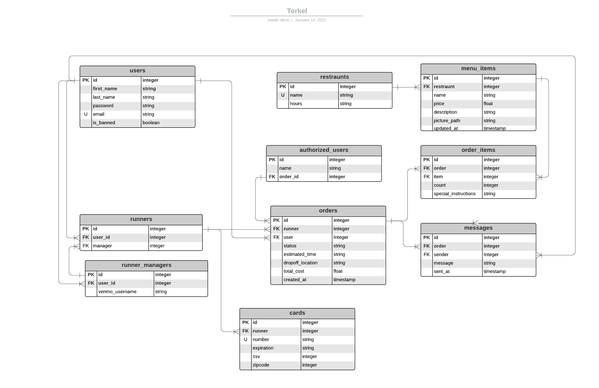

# Torkel


##
Need last minute EPR bullets? Tired of never ending struggles and the stresses of finding lunch on time? Well look no further and download Torkel today! 
Torkel stuffs.


----
## Setup

RUN
```bash
docker-compose up 
``` 
Runs the server on http://localhost:8000 with the following available endpoints


## API Endpoints

                 
Endpoint  | Contents
------------- | -------------
GET `/current/runners`  |  Order ID with information on runner for that order


## Database Schema
Here is a diagram of the database schema:

## End
